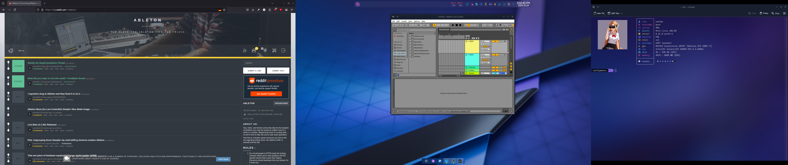
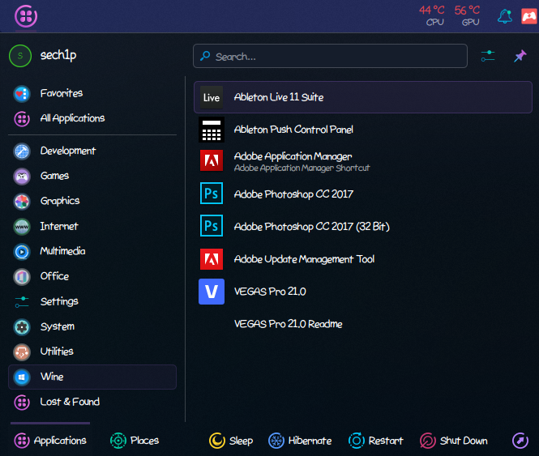

# 🎵 Ableton Live



## 🗨️ Introduction

[Ableton Live](https://en.wikipedia.org/wiki/Ableton_Live) is a digital audio workstation created by [Ableton](https://en.wikipedia.org/wiki/Ableton).

The version we will install will be Ableton Live 11, because Ableton Live 12 gave me error about not meeting the minimum requirements (5th generation Intel or AMD Ryzen).

However I have an 8th and 9th generation Intel mainboard (maybe it's because I have a low-end Celeron or I didn't install something before installing Live 12, if I find out why it didn't work for me, I'll post an update here).

This guide should works too for Ableton Live 12.

## 💾 How to install?

To install Ableton, you need [Wine](https://winehq.org), [winetricks](https://github.com/Winetricks/winetricks) and the Ableton Live installer.

Open Terminal, first you need to create a Wine prefix.

```sh
$ WINARCH=win64 WINEPREFIX=~/.ableton winecfg
```

Next, you need to install some dependencies for Ableton, you can do that by executing the command below:

```sh
$ WINARCH=win64 WINEPREFIX=~/.ableton winetricks d3dx9 dotnet35 dotnet452 dxvk gdiplusvcrun2019 corefonts tahoma vcrun6sp6 msxml6
```

Now, switch the prefix to Windows 10 compatibility mode, you can do it by the command:

```sh
$ WINARCH=win64 WINEPREFIX=~/.ableton winetricks win10
```

Now go to Ableton installation directory and do the command:

```sh
$ WINARCH=win64 WINEPREFIX=~/.ableton wine Ableton\ Live\ 11\ Installer.exe
```

Where `11` is your version of Ableton. Replace it if is different than 11. Now press the `Install` button and wait for Ableton installation end (make some coffee or tea or something in this time).

Installation time of Ableton may vary on disk speed and computer performance.

Now you should see Ableton Live entry in your menu start:



Otherwise, make a script or shortcut with the following content:

```sh
WINARCH=win64 WINEPREFIX=~/.ableton wine "~/.ableton/drive_c/ProgramData/Ableton/Live 11 Suite/Program/Ableton Live 11 Suite.exe"
```

Replace `11` with your Ableton version.

Now you have Ableton installed on your Linux. Enjoy 🌸

## 🐛 Bugs

* Ableton Live freezing

Ableton freezing on trying of maximizing or resizing window, the window will not defrost and you have to close it because it won't stop responding.
