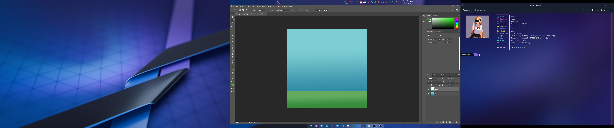
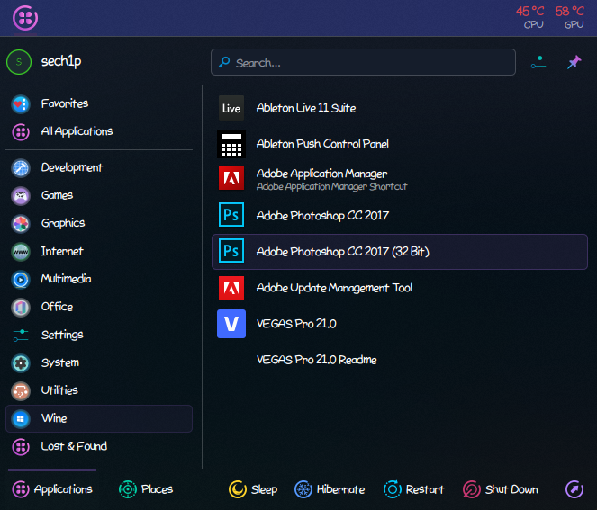

# 🎨 Photoshop



## 🗨️ Introduction

[Photoshop](https://en.wikipedia.org/wiki/Adobe_Photoshop) is a legendary graphic editor created by [Adobe](https://en.wikipedia.org/wiki/Adobe_Inc.). It supports Windows and macOS. Unfortunately, there is no native version for Linux.

The last version of Photoshop that installs on Linux (with Wine) is Photoshop CC 2017. Later versions, starting from 2018 up to the latest version 2024, as of now (October 2024) cannot install on Linux.

To get around this (only if you have Photoshop 2018 or newer), you need to install Photoshop on Windows and then move the installed Photoshop files to Linux.

⚠️ Important: **You need to install the 32-bit version of Photoshop.** On the 64-bit version, the installation will fail because for some reason there is an error during the installation of Visual C++ 2008 runtime (x64).

## 💾 How to install?

To install Photoshop, you need [Wine](https://winehq.org) (I have version 9.19), [winetricks](https://github.com/Winetricks/winetricks) and the Photoshop installer.

Open Terminal, first you need to create a Wine prefix.

```sh
$ WINARCH=win32 WINEPREFIX=~/.photoshop winecfg
```

Next, you need to install some dependencies for Photoshop, you can do that by executing the command below:

```sh
$ WINARCH=win32 WINEPREFIX=~/.photoshop winetricks atmlib gdiplus corefonts msxml3 msxml6 vcrun2005sp1 fontsmooth-rgb
```

⚠️ Important: **You must have msxml3 and msxml6 installed in your prefix**, otherwise the installation will return an error that it is "damaged". And the installation will fail

Now, switch the prefix to Windows 7 compatibility mode, you can do it by the command:

```sh
$ WINARCH=win32 WINEPREFIX=~/.photoshop winetricks win7
```

Yay! We are now halfway to installing Photoshop. Go to the Photoshop installer directory (where the `Set-up.exe` file is) and execute the command below:

```sh
$ WINARCH=win32 WINEPREFIX=~/.photoshop wine Set-up.exe
```

Now you need to uncheck Adobe Photoshop and leave only `Adobe Photoshop (32-bit)`. Now press the `Install` button.

Please wait a moment, Photoshop installation may vary depending on the speed of your computer and disk (SSD or HDD).

After installation, the Photoshop installer should inform you that Photoshop has been successfully installed. In the start menu you should see Photoshop:



Otherwise, make a script or shortcut with the following content:

```sh
WINARCH=win32 WINEPREFIX=~/.photoshop wine "~/.photoshop/drive_c/Program Files (x86)/Adobe Photoshop/Photoshop.exe"
```

Where `Adobe Photoshop` is your Photoshop directory. It may vary depending on the version. In my case it is `Adobe Photoshop CC 2017 (32 Bit)`

Well done! You have Photoshop running on Linux. Apart from some minor artifacts and performance drops for a while (which don't interfere with using it), I haven't noticed any problems with Photoshop on my machine, **it just works**.
